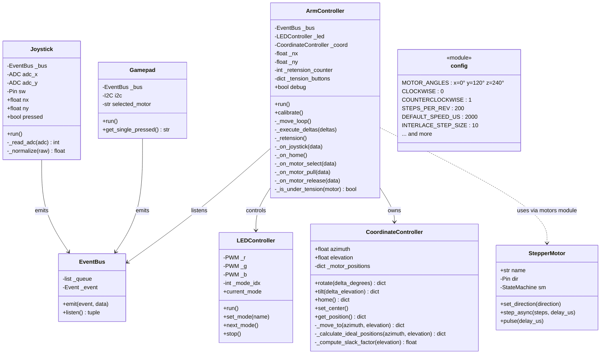
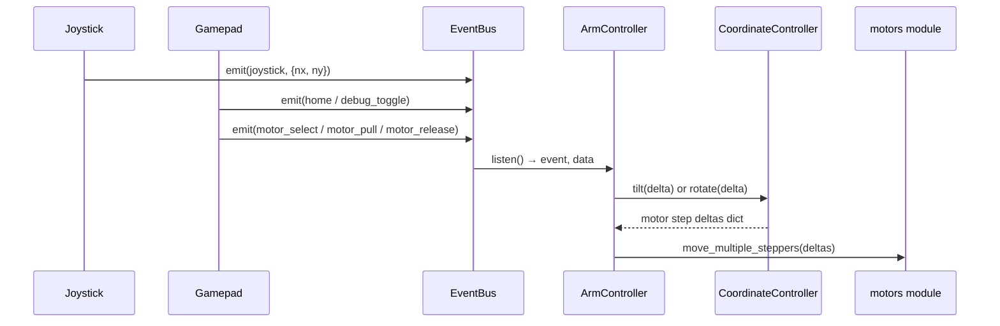

# Tentacle Arm Controller — Architecture

## Event Flow

## Module Overview

| File | Purpose |
|---|---|
| `main.py` | Entry point — wires all components together and starts asyncio tasks |
| `arm_controller.py` | Top-level control logic, joystick/gamepad event handling, retension |
| `coordinate_controller.py` | Spherical coordinate math, motor position tracking |
| `motors.py` | PIO-based stepper motor driver (`StepperMotor`) and module-level move functions |
| `led_controller.py` | Async RGB LED with switchable animation modes |
| `joystick_controller.py` | Reads analog joystick, emits `joystick` events |
| `touchpad_controller.py` | Reads I2C gamepad buttons, emits control events |
| `event_bus.py` | Async queue connecting input controllers to `ArmController` |
| `config.py` | All pin assignments, tuning constants, and motor geometry |
